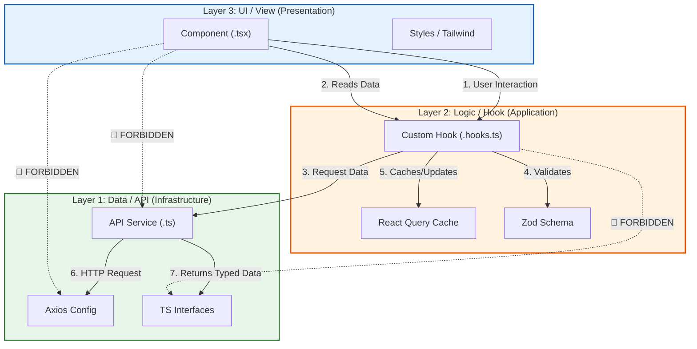

# The 3-Layer Strictness Rule (Deep Dive)

We adhere to a strict **unidirectional data flow**. This Prevents circular dependencies, "spaghetti code", and makes the codebase strictly testable.

## The Visualization

---

## Layer Definitions

### Layer 1: Data / API Layer (`src/api`, `src/interfaces`)
*   **Responsibility**: Pure HTTP communication and Data Modeling.
*   **Knowledge**: Knows **NOTHING** about the UI or React State.
*   **Role**: Defines the *Contract* (Interfaces) and the *Transport* (Axios).
*   **Rules**:
    *   ❌ No JSX.
    *   ❌ No React Hooks (useQuery, useState).
    *   ✅ Pure TypeScript functions and types.
    *   ✅ Returns Promises typed with Interfaces.

### Layer 2: Logic / Hook Layer (`src/hooks`)
*   **Responsibility**: State Management, Side Effects, Data Binding, and Validation.
*   **Knowledge**: Knows about Layer 1 (Data), but is generic to the UI (doesn't know about buttons or divs).
*   **Role**: The "Glue" or "Controller".
*   **Rules**:
    *   ✅ Calls Layer 1 (API Functions).
    *   ✅ Manages Cache (React Query).
    *   ✅ Validates Data inputs (Zod).
    *   ✅ Exposes clean methods (`onSubmit`, `isLoading`) and variables (`data`) to Layer 3.

### Layer 3: UI / View Layer (`src/ui`)
*   **Responsibility**: Visual Presentation, Layout, and User Interaction.
*   **Knowledge**: Knows about Layer 2, but **NOT** Layer 1.
*   **Role**: The "Presenter".
*   **Rules**:
    *   ❌ **NEVER import API services directly.**
    *   ❌ **NEVER import Axios directly.**
    *   ✅ Must consume data via Hooks (Layer 2).
    *   ✅ Focus on Layout, Styling, and Accessibility.

---

## Why this strictness?

1.  **Testing**: You can test Layer 2 (Hooks) without rendering a single DOM element. You can test Layer 1 (API) without React entirely.
2.  **Refactoring**: If we swap Axios for Fetch, only Layer 1 changes. If we swap Material UI for Tailwind, only Layer 3 changes.
3.  **Mental Model**: When debugging a rendering issue, you stay in Layer 3. When debugging a data issue, you stay in Layer 2.
